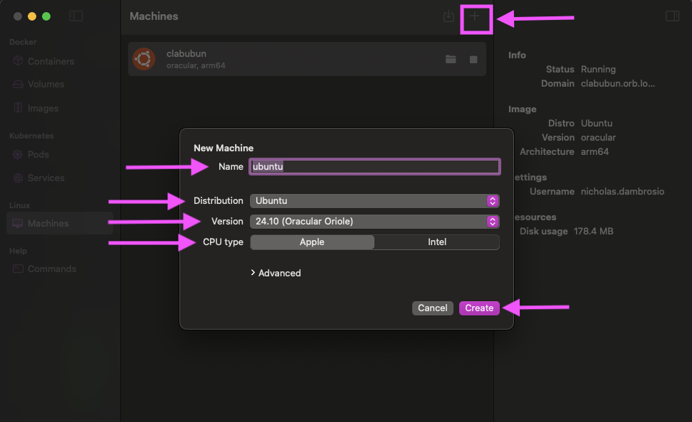
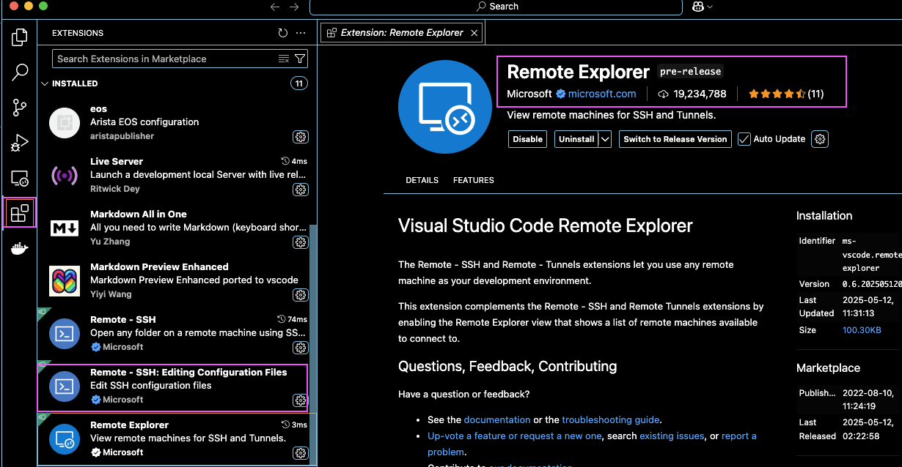
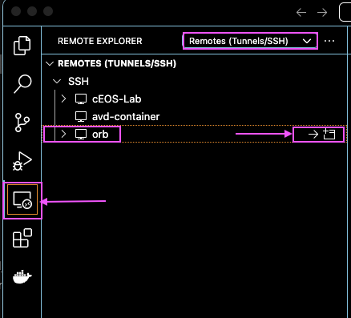
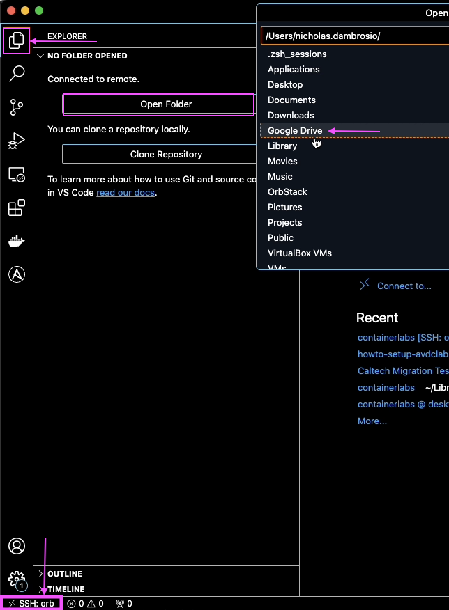

# How-To Setup Arista AVD with Containerlabs

## Table of Contents
- [How-To Setup Arista AVD with Containerlabs](#how-to-setup-arista-avd-with-containerlabs)
  - [Table of Contents](#table-of-contents)
  - [Introduction](#introduction)
  - [Prerequisites](#prerequisites)
  - [Step 1: Install Linux Host VM](#step-1-install-linux-host-vm)
    - [VM Install Using OrbStack (ARM Optimized)](#vm-install-using-orbstack-arm-optimized)
    - [Benefits vs Traditional VMs:](#benefits-vs-traditional-vms)
  - [Step 2: Install ContainerLab on Host VM](#step-2-install-containerlab-on-host-vm)
    - [Install VS Code](#install-vs-code)
    - [Attach to OrbStack via VSCode IDE](#attach-to-orbstack-via-vscode-ide)
    - [Install Containerlabs "All Componets" Scrript Using VSC](#install-containerlabs-all-componets-scrript-using-vsc)
  - [Step 3: Install Arista AVD on Host VM](#step-3-install-arista-avd-on-host-vm)
  - [Step 4: Import Arista cEOS-Lab Image Into Docker](#step-4-import-arista-ceos-lab-image-into-docker)
  - [Step 5: Copy AVD Examples to Working Directory](#step-5-copy-avd-examples-to-working-directory)
  - [Step 6: Modify ContainerLab Topology with AVD Inventory](#step-6-modify-containerlab-topology-with-avd-inventory)
  - [Step 7: Launch ContainerLab Arista cEOS Switches](#step-7-launch-containerlab-arista-ceos-switches)
  - [Step 8: Run AVD Build and Deploy](#step-8-run-avd-build-and-deploy)
  - [Troubleshooting](#troubleshooting)
  - [Additional Resources](#additional-resources)

## Introduction

This guide provides step-by-step instructions for setting up an Arista Validated Design (AVD) lab environment using ContainerLab with cEOS-Lab containers. The environment will allow you to:
- Simulate Arista network topologies
- Generate configuration templates
- Test network automation workflows
- Validate designs before production deployment

## Prerequisites

- [ ] VMware Workstation/Fusion or VirtualBox
- [ ] 8GB+ RAM allocated to host VM
- [ ] Ubuntu 20.04/22.04/24.04 LTS ISO
- [ ] Internet access from host VM
- [ ] Basic Linux command line knowledge

## Step 1: Install Linux Host VM

### VM Install Using OrbStack (ARM Optimized)

For faster performance on Apple Silicon (M1/M2/M3) Macs:

1. Install [OrbStack](https://orbstack.dev/download) (Docker + lightweight Linux VMs in one tool)
   I like to use [Homebrew](https://brew.sh/) to manage the packages installed on my macbook.

```bash
brew install orbstack
```

2.  Create a new image by hitting the '+' and fille out the following in the New Machine Menu


### Benefits vs Traditional VMs:
- 3x faster startup times
- Native ARM architecture support
- Seamless file sharing between Mac/VM
- Lower CPU/memory overhead

## Step 2: Install ContainerLab on Host VM

Before we can install Containerlabs on the host VM we need a way to connect to the host VM. To do that we first will install a development enviroment that will provide the client tools to connect to our new VM and other tool to interfcae with the programming langauages for AVD.

### Install VS Code 

First, We will install the Visual Studio Code (VSC) for our Integrated development environment (IDE) software use HomeBrew.

1. Open a terminal and apply the following HomeBre command to install VSCode.

```bash
brew install --cask visual-studio-code
```

2. Open VSCode

### Attach to OrbStack via VSCode IDE

Orbstack has a really cool integration for VSCode. When using the Remote Explorer extension VSC will establish a SSH connection to orb. The OrbStack linux machine will present itself.

1. Install VSC Code extension Remote Explorer (If you don't already have it)



2. Navigate to the Remote Explorer extension on the left nav bar and click the icon. You should see the host 'orb' in the Remotes Tunnels/SSH menu. Then client the "arrow" to launch a SSH session. 



3. Next, we will open our project folder in VSC. OrbStack has another cool integration where it will auto-magically mount the macbook file system. We can navigate to our local host file system.



### Install Containerlabs "All Componets" Scrript Using VSC


## Step 3: Install Arista AVD on Host VM

## Step 4: Import Arista cEOS-Lab Image Into Docker

## Step 5: Copy AVD Examples to Working Directory

## Step 6: Modify ContainerLab Topology with AVD Inventory

## Step 7: Launch ContainerLab Arista cEOS Switches

## Step 8: Run AVD Build and Deploy

## Troubleshooting

## Additional Resources
1. [Arista AVD Official Documentation](https://avd.arista.com/5.4/index.html)
2. [ContainerLab Documentation](https://containerlab.dev/)
3. [AVD Campus Example](https://avd.arista.com/5.4/ansible_collections/arista/avd/examples/campus-fabric/index.html)